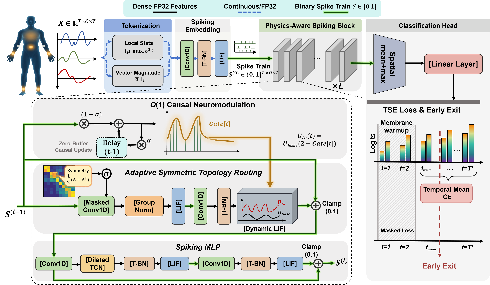

<div align="center">

# PAS-Net &nbsp;·&nbsp; Physics-Aware Spiking HAR

**Towards Green Wearable Computing: A Physics-Aware Spiking Neural Network for Energy-Efficient IMU-based Human Activity Recognition**

[](LICENSE)
[](https://www.python.org/)
[](https://pytorch.org/)
[](https://github.com/fangwei123456/spikingjelly)
[](https://arxiv.org/abs/2604.10458)
[](https://doi.org/10.48550/arXiv.2604.10458)
[]()

</div>

---

## TL;DR

We release **PAS-Net** (Physics-Aware Spiking Network)—a spiking architecture that couples **IMU physics–informed tokenization**, **adaptive topology**, and **causal neuromodulation** with **temporal early-exit** and **optional compute-energy proxy reporting** (op counts × assumed pJ/MAC and pJ/SOP—not measured device power)—together with a **single, reproducible codebase** for **eight large-scale IMU HAR benchmarks**, **seven strong ANN baselines**, and **eleven SNN baselines** under **one data pipeline**, **one training loop**, and **one evaluation protocol**. If you care about **accuracy–energy trade-offs on real wearable IMU streams**, this repo is your starting point.

---

## Overview

<p align="center">
  
  <br>
  <em>Figure: Overall architecture of PAS-Net.</em>
</p>

---

## Table of Contents

- [Features](#features)
- [Installation](#installation)
- [Data Preparation](#data-preparation)
- [Usage](#usage)
- [Repository Layout](#repository-layout)
- [Model Zoo](#model-zoo)
- [Citation](#citation)
- [References & attributions](#references--attributions)
- [Acknowledgements](#acknowledgements)

---

## Features

| Capability | Description |
|------------|-------------|
| **Unified IMU pipeline** | Same `(B, T, C, V)` batching, collate, and feeder factory across datasets. |
| **8 HAR datasets** | PAMAP2, Daily-Sports, TNDA-HAR, HuGaDB, USC-HAD, HAR70+, Parkinson (FOG), **Opportunity** (UCI OPPORTUNITY). |
| **ANN & SNN in one `train.py`** | Switch models via YAML—no second entrypoint. |
| **PAS-Net** | YAML `model.type: pas_net` + `snn-model/PAS_Net.py` (configs named `pas_net*.yaml`). Legacy alias `imu_physics_spikeformer` still accepted. |
| **Early-exit analytics** | Per–time-step / segment / prefix accuracy logging for temporal models (PAS-Net). |
| **Compute-energy proxy hooks** | Optional layer-wise proxy accounting from MAC/SOP counts × assumed pJ (see `utils/model_analysis.py`; not silicon or board measurement). |

---

## Installation

**Requirements (recommended):**

| Component | Version |
|-----------|---------|
| Python | **3.9+** |
| PyTorch | **2.0+** |
| SpikingJelly | **≥ 0.0.0.0.14** (tested with 0.0.0.0.14) |
| Other | See `requirements.txt` (`numpy`, `pandas`, `pyyaml`, `timm`, `tensorboard`, …) |

```bash
https://github.com/zhengnaichuan2022/PAS-Net.git  # placeholder URL
cd PAS-Net
pip install -r requirements.txt
```

> **Note:** `train.py` imports `spikingjelly.activation_based.functional` for `reset_net` even when **only ANN** baselines are trained; keep SpikingJelly installed, or patch `train.py` to guard the import (advanced).

---

## Data Preparation

### Supported datasets

The repo includes an **empty folder tree** under **`datasets/`** (names match the loaders). Point `dataset.data_root` to that folder—or any path you prefer—and **place or symlink** downloaded files into the matching subfolders. See **`datasets/README.md`** for the exact relative paths.

| Dataset | Key in YAML | Folder under `dataset.data_root` (same names as in `datasets/`) |
|---------|-------------|-------------------------------------------------------------------|
| PAMAP2 | `pamap2` | `pamap2+physical+activity+monitoring/` → `PAMAP2_Dataset/PAMAP2_Dataset/<protocol>/` |
| Daily-Sports | `daily_sports` | `daily+and+sports+activities/data/` |
| TNDA-HAR | `tnda` | `TNDADATASET/` |
| HuGaDB | `hugadb` | `HuGaDB/Data/` (overridable via YAML `relative_root` / `data_dir`) |
| USC-HAD | `usc_had` | `USC-HAD/USC-HAD/` |
| HAR70+ | `har70` | `har70/har70plus/` |
| Parkinson (FOG) | `parkinson` | `Parkinson/dataset/` |
| **Opportunity** (UCI) | `opportunity` | `OpportunityUCIDataset/dataset/` — run files `S*.dat` (and optional `column_names.txt`). Match the [UCI OPPORTUNITY Activity Recognition](https://archive.ics.uci.edu/dataset/226/opportunity+activity+recognition) layout (e.g. symlink or copy from a local tree such as `/path/to/your/OpportunityUCIDataset` under `data_root`). |

1. Set a **single data root** in your YAML, e.g. using the bundled layout:

   ```yaml
   dataset:
     data_root: /path/to/Physics-Aware_Spiking_HAR/datasets
   ```

2. Download each official release and extract so that **relative paths match** what the corresponding `feeder/*_feeder.py` expects (see `feeder/` for details). Raw dataset files under `datasets/` are **git-ignored** except `.gitkeep` and `datasets/README.md`.

3. **No mandatory global preprocess script**—windowing & normalization are **on-the-fly** in feeders. If you add offline preprocessing, keep the same tensor layout **`(T, C, V)` per sample** expected by `train.py`’s `collate_fn_btcv`.

---

## Usage

### Training (SNN / PAS-Net)

```bash
# Example: PAS-Net Lite on PAMAP2 (subject-independent split in YAML)
python train.py --config snn-config/pamap2/pas_net_lite.yaml
```

```bash
# Full PAS-Net-style config (deeper / wider—see yaml for depth & embed_dims)
python train.py --config snn-config/pamap2/pas_net.yaml
```

```bash
# Resume from checkpoint
python train.py --config snn-config/pamap2/pas_net_lite.yaml \
  --resume path/to/checkpoint.pth
```

### Training (ANN baselines)

```bash
python train.py --config ann-config/pamap2/deep_conv_lstm_ann.yaml
# …other ANN yaml files under ann-config/<dataset>/
```

> **Import path:** this repo uses **`snn_model`** as the Python package name for **`snn-model/`** (via symlink `snn_model → snn-model`). Keep training invoked from the **repository root**.

### Evaluation

- **Validation accuracy** is reported each epoch inside `train.py` (same loop as training).
- **Best checkpoint** path is printed at the end; metrics are also written under `project.exp_dir` / `project.log_file` as configured in YAML.
- For **paper appendix figures** (firing-rate tables, smart-valve dynamics, spatiotemporal matrices), use the companion scripts from the **full development tree** (e.g. `scripts/generate_real_spatiotemporal_matrix.py`, `scripts/plot_smart_valve_dynamics.py`) if you copy them into `./tools/`:

```bash
# Optional (after adding scripts from the release bundle)
python tools/generate_real_spatiotemporal_matrix.py --save-md results/spatiotemporal_matrix.md
python tools/plot_smart_valve_dynamics.py --pamap2-activity-ids 4,5 --num-samples 5
```

---

## Repository Layout

```text
.
├── README.md
├── requirements.txt
├── datasets/                # Empty layout + README for 8 IMU benchmarks (incl. Opportunity); see datasets/README.md
├── train.py                 # Single entry: SNN + ANN, driven by YAML
├── snn-config/              # SNN & PAS-Net experiment configs (per dataset)
├── snn-model/               # SNN implementations + model_factory
│   ├── PAS_Net.py           # PAS-Net (paper core)
│   ├── spikformer.py
│   ├── spike_driven_transformer*.py
│   └── …
├── snn_model -> snn-model   # Symlink for valid Python imports (hyphen-free)
├── ann-config/              # ANN baseline configs
├── ann-model/               # ANN baseline implementations
├── feeder/                  # Unified dataset loaders + feeder_factory
└── utils/                   # config_loader, model_analysis, …
```

---

## Model Zoo

All models are selected via `model.type` and `model.model_file` in YAML. Below is a concise **English** index.

### Our method

| Model | `model.type` (YAML) | Implementation |
|-------|----------------------|----------------|
| **PAS-Net** | `pas_net` | `snn-model/PAS_Net.py` |

### ANN baselines (7 families)

| Baseline | `model.type` | Module |
|----------|--------------|--------|
| DeepConvLSTM | `deep_conv_lstm_ann` | `ann-model/deep_conv_lstm_ann.py` |
| ResNet + SE | `resnet_se_ann` | `ann-model/resnet_se_ann.py` |
| MCH-CNN-GRU | `mch_cnn_gru_ann` | `ann-model/mch_cnn_gru_ann.py` |
| RTSFNet | `rtsfnet_ann` | `ann-model/rtsfnet_ann.py` |
| UniHAR | `unihar_ann` | `ann-model/unihar_ann.py` |
| SelfHAR | `selfhar_ann` | `ann-model/selfhar_ann.py` |
| IF-ConvTransformer | `if_convtransformer_ann` | `ann-model/if_convtransformer_ann.py` |

### SNN baselines (representative set)

| Baseline | `model.type` | Module |
|----------|--------------|--------|
| Spikeformer | `spikformer` | `snn-model/spikformer.py` |
| Spike Driven Transformer | `spike_driven_transformer` / `sdt` | `snn-model/spike_driven_transformer.py` |
| Spike Driven Transformer v2 | `spike_driven_transformer_v2` / `sdt_v2` | `snn-model/spike_driven_transformer_v2.py` |
| ST-Attn | `stattn` | `snn-model/stattn.py` |
| LMUFormer | `lmuformer` | `snn-model/lmuformer.py` |
| QKFormer-IMU | `qkformer_imu` | `snn-model/qkformer_imu.py` |
| Spike-RNN / Spike-GRU / TSSNN / Spike-TCN2D | `spike_rnn_har`, … | `snn-model/seqsnn_har_models.py` |
| Simple SNN | `simple_snn` | `snn-model/simple_snn_model.py` |

> *Exact counts of “11 SNN baselines” in the paper correspond to the selected configurations in the camera-ready table; this codebase supports the union of implementations above.*

---

## Citation

If you use this code or our benchmark protocol, please cite the paper (preprint on arXiv):

```bibtex
@misc{zheng2026pasnet,
  title        = {Towards Green Wearable Computing: A Physics-Aware Spiking Neural Network for Energy-Efficient IMU-based Human Activity Recognition},
  author       = {Zheng, Naichuan and Xia, Hailun and Sun, Zepeng and Li, Weiyi and Zhou, Yinze},
  year         = {2026},
  eprint       = {2604.10458},
  archivePrefix = {arXiv},
  primaryClass = {cs.LG},
  doi          = {10.48550/arXiv.2604.10458},
  url          = {https://arxiv.org/abs/2604.10458}
}
```

Short link: [https://doi.org/10.48550/arXiv.2604.10458](https://doi.org/10.48550/arXiv.2604.10458) · [arXiv:2604.10458 \[cs.LG\]](https://arxiv.org/abs/2604.10458)

---

## References & attributions

When you report results or redistribute derived splits, please cite the **original datasets**, **baseline models** (ANN & SNN families below), and **libraries** you used—not only this repository.

### Datasets

| Dataset | How to cite (short) | Primary link |
|--------|----------------------|--------------|
| **PAMAP2** | Reiss, A., & Stricker, D. (2012). *Introducing a new benchmarked dataset for activity monitoring.* ISWC. | [UCI ML Repository](https://archive.ics.uci.edu/dataset/231/pamap2+physical+activity+monitoring) — dataset DOI [10.24432/C5NW2H](https://doi.org/10.24432/C5NW2H) |
| **Daily and Sports Activities** | Barshan, B., & Yüksek, M. C. (2014). Recognizing daily and sports activities in two open source machine learning environments using body-worn sensor units. *The Computer Journal*, 57(11), 1649–1667. [10.1093/comjnl/bxt075](https://doi.org/10.1093/comjnl/bxt075) | [UCI ML Repository](https://archive.ics.uci.edu/dataset/256/daily+and+sports+activities) — dataset DOI [10.24432/C5C59F](https://doi.org/10.24432/C5C59F) |
| **TNDA-HAR** | Yan, Y., Chen, D., Liu, Y., Zhao, J., Wang, B., Wu, X., Jiao, X., Chen, Y., Li, H., & Ren, X. (2021). *TNDA-HAR: Topological Nonlinear Dynamics Analysis Dataset for Human Activity Recognition.* IEEE Dataport. DOI [10.21227/4epb-pg26](https://doi.org/10.21227/4epb-pg26) | [IEEE Dataport](https://ieee-dataport.org/open-access/tnda-har-0) |
| **HuGaDB** | Chereshnev, R., & Kertész-Farkas, Á. (2017). HuGaDB: Human gait database for activity recognition from wearable inertial sensor networks. In *AIST* (LNCS 10637). Preprint: [arXiv:1705.08506](https://arxiv.org/abs/1705.08506) | Project / data: see dataset authors’ distribution (used via `feeder/hugadb_feeder.py`) |
| **USC-HAD** | Zhang, M., & Sawchuk, A. A. (2012). USC-HAD: A daily activity dataset for ubiquitous activity recognition using wearable sensors. *UbiComp* (Adjunct). [10.1145/2370216.2370438](https://doi.org/10.1145/2370216.2370438) | [USC dataset page](http://sipi.usc.edu/had/) (mirror / downloads may vary) |
| **HAR70+** | Logacjov, A., & Ustad, A. HAR70+ [Dataset]. UCI Machine Learning Repository. DOI [10.24432/C5CW3D](https://doi.org/10.24432/C5CW3D). Associated paper: Ustad, A., et al. (2023). Validation of an activity type recognition model classifying daily physical behavior in older adults: The HAR70+ model. *Sensors*, 23(5), 2368. [10.3390/s23052368](https://doi.org/10.3390/s23052368) | [UCI ML Repository](https://archive.ics.uci.edu/dataset/780/har70) |
| **Parkinson (FOG)** | The loader expects `SxxRxx.txt` recordings consistent with the **DAPHNet** (Daphnet Freezing of Gait) release. Bachlin, M., Plotnik, M., Roggen, D., Maidan, I., Hausdorff, J. M., Giladi, N., & Tröster, G. (2010). Wearable assistant for Parkinson’s disease patients with the freezing of gait symptom. *IEEE Trans. Inf. Technol. Biomed.*, 14(2), 436–446. [10.1109/TITB.2009.2036165](https://doi.org/10.1109/TITB.2009.2036165) | [UCI ML Repository](https://archive.ics.uci.edu/dataset/245/daphnet+freezing+of+gait) — dataset DOI [10.24432/C56K78](https://doi.org/10.24432/C56K78) |
| **Opportunity** | Roggen, D., Calatroni, A., Nguyen-Dinh, L., Chavarriaga, R., & Sagha, H. (2010). OPPORTUNITY Activity Recognition [Dataset]. UCI Machine Learning Repository. [10.24432/C5M027](https://doi.org/10.24432/C5M027). See also Roggen et al., *Collecting complex activity datasets in highly rich networked sensor environments* (INSS 2010). | [UCI ML Repository](https://archive.ics.uci.edu/dataset/226/opportunity+activity+recognition) |

### SNN baseline models (spiking Transformers & related)

Cite the corresponding paper whenever you report results for these `model.type` entries (implementations live under `snn-model/`).

| `model.type` | Method | How to cite |
|----------------|--------|-------------|
| `spikformer` | Spikformer | Zhou, Z., et al. (2023). Spikformer: When spiking neural network meets Transformer. *ICLR*. [OpenReview](https://openreview.net/forum?id=frE4fUwz_h) |
| `spike_driven_transformer`, `sdt` | Spike-driven Transformer | Yao, M., et al. (2023). Spike-driven Transformer. *NeurIPS*. [OpenReview](https://openreview.net/forum?id=9FmolyOHi5) |
| `spike_driven_transformer_v2`, `sdt_v2` | Spike-driven Transformer V2 (Meta-SpikeFormer) | Yao, M., et al. (2024). Spike-driven Transformer V2: Meta spiking neural network architecture inspiring the design of next-generation neuromorphic chips. *ICLR*. [OpenReview](https://openreview.net/forum?id=1SIBN5Xyw7) |
| `stattn` | STAtten | Lee, D., et al. (2025). Spiking Transformer with Spatial-Temporal Attention. *CVPR*. [arXiv:2409.19764](https://arxiv.org/abs/2409.19764) (extends spike-driven Transformer–style training; also cite Yao et al. 2023 for the SDT backbone lineage if you compare to SDT). |
| `lmuformer` | LMUFormer | Liu, Z., et al. (2024). LMUFormer: Low complexity yet powerful spiking model with Legendre memory units. *ICLR*. [OpenReview](https://openreview.net/forum?id=oEF7qExD9F), [arXiv:2402.04882](https://arxiv.org/abs/2402.04882). *LMU theory:* Voelker, A., Kajić, I., & Eliasmith, C. (2019). Legendre Memory Units. *NeurIPS*. |
| `qkformer_imu` | QKFormer (IMU head) | Zhou, C., et al. (2024). QKFormer: Hierarchical spiking Transformer using Q–K attention. *NeurIPS*. [arXiv:2403.16552](https://arxiv.org/abs/2403.16552). If you use **relative positional encoding** variants bundled with QKFormer in other codebases, also cite Lv, C., et al. *Toward relative positional encoding in spiking Transformers.* [arXiv:2501.16745](https://arxiv.org/abs/2501.16745). |
| `spike_rnn_har`, `spike_gru_har`, … | SeqSNN-style recurrent / TCN baselines | Cite the architecture paper you follow (e.g. Chung et al., 2014 for GRU; LSTM: Hochreiter & Schmidhuber, 1997) and any task-specific SNN reference you used. |

**Optional cross-repo tooling (only if you use distillation / ImageNet teachers in related experiments):** DeiT — Touvron et al. (2021) *ICML*; MetaFormer / PoolFormer — Yu et al. (2022) *CVPR*; AST — Gong et al. (2021) *Interspeech*.

### ANN baseline models (seven families)

Cite the corresponding work when you report ANN results (`ann-model/`, `ann-config/`).

| `model.type` | Module | How to cite |
|--------------|--------|-------------|
| `deep_conv_lstm_ann` | DeepConvLSTM-style CNN+LSTM | Ordóñez, F. J., & Roggen, D. (2016). Deep convolutional and LSTM recurrent neural networks for multimodal wearable activity recognition. *Sensors*, 16(1), 115. |
| `resnet_se_ann` | ResNet-1D + squeeze–excitation | He, K., et al. (2016). Deep residual learning for image recognition. *CVPR*; Hu, J., et al. (2018). Squeeze-and-excitation networks. *CVPR*. |
| `mch_cnn_gru_ann` | Multi-kernel CNN + GRU | Multi-scale convolutional front-end + GRU: Chung, J., et al. (2014). Empirical evaluation of gated recurrent neural networks on sequence modeling. *arXiv:1412.3555*; cite alongside CNN–RNN HAR literature as appropriate. |
| `rtsfnet_ann` | rTsfNet-style rotation + time-series features | Enokibori, Y. (2024). rTsfNet: A DNN model with multi-head 3D rotation and time series feature extraction for IMU-based human activity recognition. *Proc. ACM Interact. Mob. Wearable Ubiquitous Technol.* [10.1145/3699733](https://doi.org/10.1145/3699733) |
| `unihar_ann` | UniHAR-style trunk + domain-adaptive BN | Xu, H., et al. (2023). Practically adopting human activity recognition. *MobiCom*. [10.1145/3570361.3613299](https://doi.org/10.1145/3570361.3613299) |
| `selfhar_ann` | Self-training / self-supervised HAR-style | Tang, C. I., et al. (2021). SelfHAR: Improving human activity recognition through self-training with unlabeled data. *Proc. ACM Interact. Mob. Wearable Ubiquitous Technol.* [arXiv:2102.06073](https://arxiv.org/abs/2102.06073) |
| `if_convtransformer_ann` | IF-ConvTransformer | Zhang, Y., et al. (2022). IF-ConvTransformer: A framework for human activity recognition using IMU fusion and ConvTransformer. *Proc. ACM Interact. Mob. Wearable Ubiquitous Technol.* [10.1145/3534584](https://doi.org/10.1145/3534584) |

### Software and libraries

| Library | Citation / attribution |
|---------|-------------------------|
| **PyTorch** | Paszke, A., et al. (2019). PyTorch: An imperative style, high-performance deep learning library. *NeurIPS*. [pytorch.org](https://pytorch.org/) — see also [PyTorch — Citing](https://pytorch.org/). |
| **torchvision** | Same PyTorch project; cite PyTorch and the torchvision release you used. |
| **SpikingJelly** | Fang, W., et al. SpikingJelly: An open-source deep learning framework for SNNs. [GitHub](https://github.com/fangwei123456/spikingjelly); if you use it in publications, cite the project README / associated materials as requested there. |
| **timm** | Wightman, R. *PyTorch Image Models.* [GitHub](https://github.com/huggingface/pytorch-image-models) — see repository for BibTeX. |
| **NumPy** | Harris, C. R., et al. (2020). Array programming with NumPy. *Nature*, 585, 357–362. |
| **pandas** | McKinney, W. (2010). Data structures for statistical computing in Python. *SciPy* proceedings. |
| **SciPy** | Virtanen, P., et al. (2020). SciPy 1.0: Fundamental algorithms for scientific computing in Python. *Nature Methods*, 17, 261–272. |
| **scikit-learn** | Pedregosa, F., et al. (2011). Scikit-learn: Machine learning in Python. *JMLR*, 12, 2825–2830. |
| **TensorBoard** | TensorBoard is part of the TensorFlow project; cite the TensorBoard / TensorFlow release you used, or the [TensorBoard README](https://github.com/tensorflow/tensorboard). |
| **Matplotlib** | Hunter, J. D. (2007). Matplotlib: A 2D graphics environment. *Computing in Science & Engineering*, 9(3), 90–95. |

---

## Acknowledgements

- [SpikingJelly](https://github.com/fangwei123456/spikingjelly) for efficient SNN primitives and `reset_net`.
- Authors and maintainers of the public datasets listed under [References & attributions](#references--attributions).
- Authors of the **SNN** (Spikformer, spike-driven Transformer, STAtten, LMUFormer, QKFormer, …) and **ANN** baseline methods cited in the same section.

---

<p align="center">
  <b>PAS-Net</b> — Physics-Aware Spiking HAR &nbsp;|&nbsp; Built for reproducible green wearable AI research.
</p>
